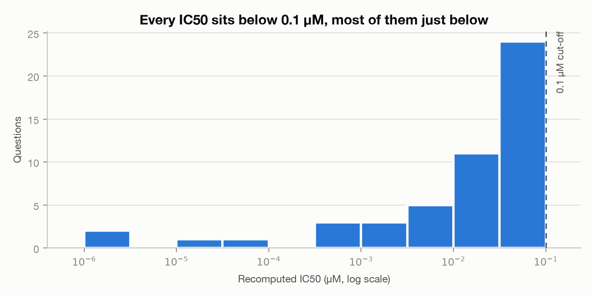
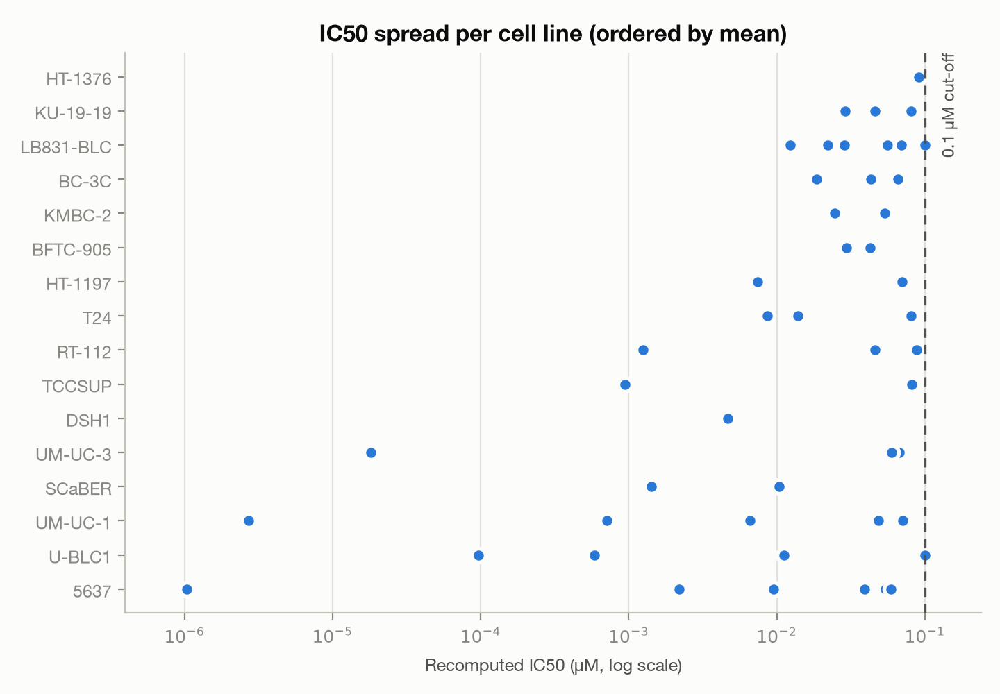
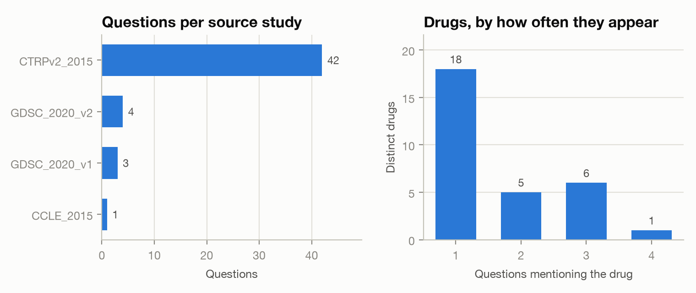

# EDA: `data/private_qa.json`

**Source:** `owkin/technical_test` (private HF dataset), `train` split, first 50 records, pulled by `src/data_fetching.py`.
**Reproduce the figures:** `uv run --with matplotlib python docs/make_plots.py`

---

## Headline

The file is a **50-row multiple-choice set asking whether a bladder-cancer cell line is sensitive to a drug**. It is well-formed — no missing fields, no duplicate questions, no malformed options — but it is **degenerate as an evaluation set**:

| | |
|---|---|
| Rows | 50 |
| Distinct questions | 50 (no duplicates) |
| Distinct `(cell_line, drug)` pairs | 50 (no duplicates) |
| **Correct label** | **`Yes` in 50/50 rows** |
| Indications | **1** (`Bladder/Urinary Tract`) |
| Question templates | **1** |
| Answer key | `A` ×29 / `B` ×21 |

Because every answer is `Yes`, **a model that ignores the question and always answers "sensitive" scores 100%**. The only thing that varies between rows is which letter `Yes` was shuffled onto, so the set measures option-position handling and nothing else. Always answering `A` scores 58%.

This is almost certainly an artefact of *how* the file was sampled, not of the dataset — see [Sampling](#sampling-is-the-likely-cause) below.

---

## Schema

Four top-level fields, all populated in all 50 rows:

| Field | Type | Notes |
|---|---|---|
| `question` | str | 14–16 words, 94–126 chars, one template |
| `options` | str | A **JSON-encoded string**, not an object: `'{"A": "Yes", "B": "No"}'` — needs a second `json.loads` |
| `answer` | str | `A` or `B`; verified to map to `metadata.label` in all 50 rows |
| `metadata` | dict | 9 keys, all present in all 50 rows |

The single template is:

> `Would the {indication} cancer cell line {cell_line} be sensitive to treatment with {drug}?`

**No answer leakage in the prompt.** The rendered question exposes only indication, cell line and drug — the IC50 that determines the label is never shown.

### Metadata columns

| Key | Distinct values | Comment |
|---|---|---|
| `cell_line` | 16 | |
| `drug` | 30 | includes 2 fixed-ratio **combinations** |
| `indication` | **1** | constant — `Bladder/Urinary Tract` |
| `label` | **1** | constant — `Yes` |
| `study` | 4 | heavily skewed to `CTRPv2_2015` |
| `template` | **1** | constant |
| `ic50_recomputed` | 50 | float, µM |
| `has_admet_hint` | **1** | constant `False` — dead column in this slice |
| `test_scenario` | **1** | constant `""` — dead column in this slice |

Four of nine metadata columns carry zero information here. `has_admet_hint` and `test_scenario` look like flags for question variants that this slice simply doesn't contain.

---

## The label is a threshold on IC50

<picture>
  <source media="(prefers-color-scheme: dark)" srcset="figures/ic50-distribution-dark.png">
  
</picture>

`ic50_recomputed` spans nearly five orders of magnitude (1.04×10⁻⁶ to 9.99×10⁻² µM) and then **stops dead just under 0.1**. The maximum is `0.0999142` — no value exceeds the round number, and three rows sit within 10% of it.

That ceiling is the label rule: **`ic50_recomputed < 0.1 µM` ⇒ `label = "Yes"`**. Every row here is `Yes` precisely because every row is below the cut-off, which means the sample was drawn from one side of the decision boundary.

| p10 | p25 | median | p75 | p90 | max |
|---|---|---|---|---|---|
| 0.00060 | 0.00723 | 0.02925 | 0.06620 | 0.08116 | 0.09991 |

**70% of rows sit in `[0.01, 0.1)` and 36% in `[0.05, 0.1)`** — the positives are mostly *borderline*, hugging the threshold rather than being obvious wins. Any reasoning trace that concludes "sensitive" for these needs to invoke the 0.1 µM convention explicitly; the underlying potency is often unremarkable.

<picture>
  <source media="(prefers-color-scheme: dark)" srcset="figures/ic50-by-cell-line-dark.png">
  
</picture>

Spread is within-cell-line, not between: the ranking by mean is driven by one or two low outliers each (5637, UM-UC-1, U-BLC1), while nearly every cell line also has a point pressed up against the cut-off. There is no cell line here that is uniformly, comfortably sensitive.

---

## Coverage

<picture>
  <source media="(prefers-color-scheme: dark)" srcset="figures/coverage-dark.png">
  
</picture>

- **Study skew.** `CTRPv2_2015` supplies 42/50 rows; `CCLE_2015` supplies one. Any per-study comparison is unpowered.
- **Sparse grid.** 16 cell lines × 30 drugs = 480 possible pairs; 50 are present (~10%), all distinct. Cell-line counts run 1–6, drug counts 1–4.
- **Long tail.** 18 of 30 drugs appear exactly once, so most drugs contribute a single data point.
- **Combination drugs.** Two entries are fixed-ratio combinations — `docetaxel:tanespimycin (2:1 mol/mol)` and `tanespimycin:gemcitabine (1:1 mol/mol)`. Note the lowercase names and the embedded colon/parentheses: anything that looks a drug up by name, or splits on `:`, will need to handle these as a special case.

---

## Sampling is the likely cause

`src/data_fetching.py` takes `dataset.select(range(50))` — the **first 50 rows in file order**, not a random draw. The fact that this slice is 100% `Yes`, 100% bladder, 100% one template and 100% below the IC50 threshold is exactly what you'd expect from the head of a file sorted by indication and label. The full dataset very likely contains negatives, other indications, `test_scenario` variants and `has_admet_hint=True` rows — none of which are visible here.

**Nothing in this report should be read as a property of `owkin/technical_test`.** It describes a 50-row head slice.

---

## Implications for reasoning-trace generation

1. **This slice cannot validate anything.** Accuracy, calibration and trace quality are all unmeasurable against a constant label. Before generating traces, re-fetch a shuffled, label-balanced sample.
2. **Guard against the degenerate policy.** With an all-`Yes` set, a generator that always reasons its way to "sensitive" looks perfect. Score against a set containing `No` rows, or the metric is meaningless.
3. **Traces must name the threshold.** With 36% of rows in `[0.05, 0.1)`, "sensitive" is a statement about a 0.1 µM convention, not about strong potency. A trace that argues from mechanism alone will be right by luck on this slice and wrong on the other side of the boundary.
4. **Position bias is the only signal present.** The A/B shuffle is the one real axis of variation. It is worth measuring option-order sensitivity on exactly this slice — but as a bias probe, not as an accuracy benchmark.
5. **Parse `options` twice.** It is a JSON string inside JSON. Also handle the two combination-drug names.

## Suggested next step

Re-pull with a shuffle and check, on the full split, whether `label` is balanced, which indications exist, and how many rows have non-empty `test_scenario` or `has_admet_hint=True`. That determines whether the interesting question variants are even in scope.
