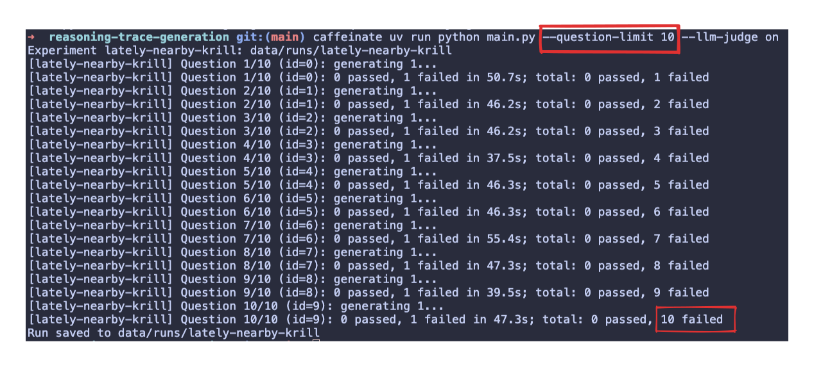
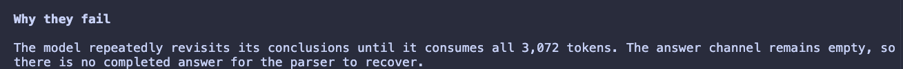

# Supervised Fine Tuning Data Pipeline

---

Goals:

- Inference with structured output and reasoning traces
- Filter by correctness of structure
- Filter by correctness of answer
- Filter by hallucination / reasoning quality

---

Basic approach:

- Lean hard on programmatic checks (ty, basedpyright, ruff)
- Plenty of unit tests
- integration tests which _do not_ mock ollama.
- Utilise pydantic framework instead of string manipulation

---

Basic architecture

---

Hallucination filtering

---

---

Hallucination failure rate

---

Problems

- Many of the answers are constrained to a very small range of categorical answers. This means a correctness gate is unlikely to provide the protection we might expect it to.
- Reasoning traces from the Qwen model show a _lot_ of hallucinations.
- ***

Iterating

---

How would we improve this?

- Constrained optimisation over hyperparameters:
  - Max tokens
  - System prompt
  - Inclusion / exclusion of supporting information

Could optimise for:

- Time
- Lval score of reasoning traces
- Number of accepted reasoning traces
