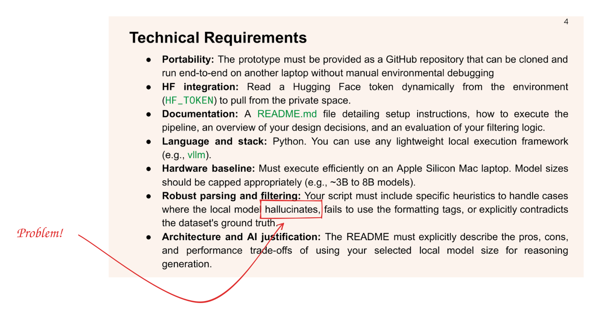
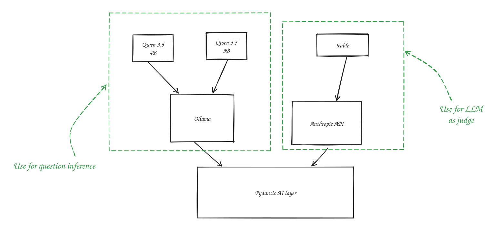

# Supervised Fine Tuning Data Pipeline

---

Goals:
- Inference with structured output and reasoning traces
- Filter by correctness of structure
- Filter by correctness of answer
- Filter by hallucination / reasoning quality

---
Basic approach:
- Lean hard on programmatic checks 
- Plenty of unit + integration tests

---
Inference

---

Quality filtering

---

Hallucination filtering

---

Basic architecture

---

How would we improve this?
- Constrained optimisation over hyperparameters:
  - Max tokens
  - System prompt
  - Inclusion / exclusion of supporting information

Could optimise for:
- Time
- Lval score of reasoning traces
- Number of accepted reasoning traces
